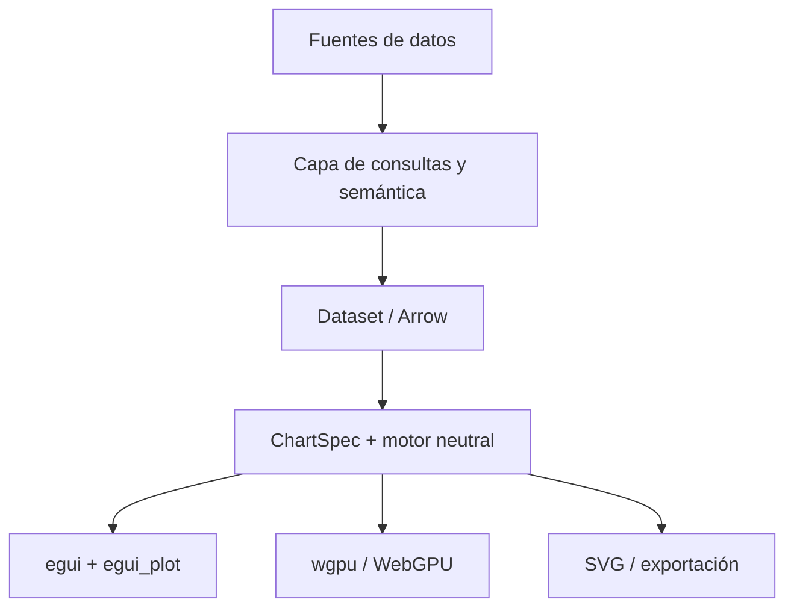

# Plataforma universal de visualización y analítica en Rust

> Nombre provisional del proyecto. Este documento conserva la visión, las decisiones técnicas y el camino inicial para no perder el propósito mientras el proyecto evoluciona.

## Visión

Construir una plataforma de visualización y análisis de datos desarrollada principalmente en Rust, capaz de combinar ideas de **Plotly**, **Matplotlib**, **Apache Superset**, **Power BI**, **Tableau** y **Rerun**.

El objetivo no es crear solamente una colección de gráficas. La plataforma deberá permitir:

- Explorar datos científicos, empresariales, financieros y en tiempo real.
- Crear gráficas interactivas con hover, tooltips, zoom, desplazamiento, selección y animaciones.
- Construir dashboards con filtros y visualizaciones conectadas.
- Consumir archivos, APIs, streams y bases de datos.
- Ejecutarse como aplicación nativa de escritorio.
- Publicar dashboards en la web.
- Embeber gráficas individuales en Angular, Next, Nuxt, React, Vue, Leptos u otras aplicaciones.
- Llegar posteriormente a dispositivos móviles.
- Exportar visualizaciones como SVG, PNG o PDF.

La aplicación de escritorio será el primer cliente del proyecto, pero el producto central será un **motor de visualización reutilizable y multiplataforma**.

## Principios

1. **Rust como tecnología principal.**
2. **El motor no debe quedar acoplado a una GUI.** egui será el primer frontend, no la única plataforma posible.
3. **Una sola especificación para todos los destinos.** La misma `ChartSpec` deberá poder renderizarse en escritorio, web, móvil o SVG.
4. **Interactividad como característica central.** Hover, zoom, selección y filtros no serán añadidos secundarios.
5. **Arquitectura modular.** Los usuarios podrán utilizar solamente el motor gráfico, el dashboard completo o los conectores de datos.
6. **Rendimiento progresivo.** Comenzar con `egui_plot` y añadir renderizado especializado con `wgpu` cuando sea necesario.
7. **IA opcional.** Burn no será una dependencia obligatoria del núcleo.

## Experiencia deseada

Un usuario debería poder:

1. Abrir un CSV, JSON o Parquet, o conectarse a una base de datos.
2. Elegir o arrastrar columnas hacia los canales X, Y, color, tamaño o categoría.
3. Crear una visualización sin escribir código.
4. Cambiar entre líneas, barras, scatter, heatmap u otros tipos compatibles.
5. Explorar los datos mediante hover, zoom y selección.
6. Colocar varias visualizaciones en un dashboard.
7. Seleccionar datos en una gráfica y filtrar automáticamente las demás.
8. Guardar el proyecto mediante una especificación portable.
9. Publicar el dashboard o embeber una gráfica en otra aplicación.

## Arquitectura propuesta



### Núcleo neutral

El núcleo contendrá lo que una gráfica **es y cómo se comporta**, sin llamar directamente a egui:

```text
chart-core
├── ChartSpec
├── Dataset
├── escalas y ejes
├── transformaciones de coordenadas
├── layout
├── estado interactivo
├── selección y filtros
├── animaciones
├── hit-testing
└── escena o primitivas neutrales
```

Ejemplo conceptual:

```rust
pub struct ChartSpec {
    pub title: String,
    pub mark: Mark,
    pub x: Encoding,
    pub y: Encoding,
    pub color: Option<Encoding>,
    pub interactions: Interactions,
}

pub enum Mark {
    Line,
    Bar,
    Scatter,
    Area,
    Histogram,
    Heatmap,
    Candlestick,
}
```

### Primer renderizador: egui_plot

La primera versión utilizará:

- `eframe` para la aplicación de escritorio.
- `egui` para la interfaz.
- `egui_plot` para las primeras gráficas 2D interactivas.

`egui_plot` ya proporciona una base útil de hover, zoom, desplazamiento, ejes, leyendas, líneas, puntos y barras. El adaptador convertirá `ChartSpec` y `Dataset` a sus tipos:

```text
chart-core
    ↓
chart-egui-plot
    ↓
egui_plot
```

La lógica propia de la plataforma no deberá exponer innecesariamente tipos de `egui_plot`. Esto permitirá añadir otros renderizadores sin rehacer el modelo completo.

### Renderizado avanzado

Cuando una visualización no pueda resolverse adecuadamente con `egui_plot`, se añadirá un backend basado en `wgpu` para:

- Grandes cantidades de puntos.
- Heatmaps avanzados.
- Nubes de puntos.
- Superficies y escenas 3D.
- Shaders personalizados.
- Renderizado nativo y WebGPU.

También se estudiarán componentes y patrones de:

- `egui-charts`, especialmente escalas, crosshair, hit-testing y herramientas de dibujo.
- Rerun, especialmente datos temporales, escenas 2D/3D y combinación de egui con wgpu.
- GPUI Component y Longbridge como referencia de interfaz comercial y gráficos financieros.

## Datos y analítica

### Fuentes iniciales

- Datos simulados.
- CSV.
- JSON.
- Parquet.
- APIs REST.
- WebSocket y datos en tiempo real.
- PostgreSQL y SQLite posteriormente.

### Tecnologías candidatas

| Necesidad | Tecnología candidata |
| --- | --- |
| DataFrames | Polars |
| Representación columnar | Apache Arrow |
| Consultas analíticas | DataFusion |
| Arrays científicos | ndarray |
| Conexión SQL | SQLx |
| API del servidor | Axum |
| Capa semántica opcional | Cube Core |

Cube Core podrá utilizarse como servicio opcional para definir métricas, dimensiones, relaciones, agregaciones, permisos y caché. La plataforma no deberá depender exclusivamente de Cube: se diseñará una abstracción de proveedores.

```rust
pub trait DataProvider {
    async fn query(
        &self,
        request: QueryRequest,
    ) -> Result<Dataset, DataError>;
}
```

Proveedores posibles:

```text
DataProvider
├── MockProvider
├── CsvProvider
├── PolarsProvider
├── DataFusionProvider
├── DirectSqlProvider
├── CubeProvider
└── StreamingProvider
```

## Visualizaciones previstas

### Empresariales y BI

- Barras simples, agrupadas y apiladas.
- Líneas y áreas.
- Pie y donut.
- KPI y gauge.
- Funnel.
- Treemap.
- Sankey.
- Tablas y tablas dinámicas.
- Mapas geográficos.

### Científicas

- Scatter.
- Histogramas.
- Box plot y violin plot.
- Barras de error.
- Heatmaps.
- Contornos.
- Campos vectoriales.
- Series de señales.
- Superficies 3D.

### Financieras

- Candlestick y OHLC.
- Volumen.
- Indicadores técnicos.
- Renko y Kagi.
- Anotaciones y herramientas de medición.

### Especializadas

- Grafos y redes.
- Timelines.
- Gantt.
- Árboles y jerarquías.
- Nubes de puntos.
- Imágenes, vídeo y sensores sincronizados.

## Interactividad

El motor deberá evolucionar para admitir:

- Hover y tooltips configurables.
- Zoom y desplazamiento.
- Crosshair.
- Selección por punto, rectángulo o lazo.
- Selección múltiple.
- Drill-down.
- Leyendas interactivas.
- Anotaciones.
- Animaciones.
- Datos en tiempo real.
- Filtros compartidos.
- Cross-filtering entre visualizaciones.
- Undo/redo para acciones editables.

Los eventos se normalizarán para que puedan proceder del mouse, touch o pointer web:

```rust
pub enum ChartEvent {
    PointerMoved { x: f32, y: f32 },
    PointerPressed { x: f32, y: f32 },
    PointerReleased { x: f32, y: f32 },
    Zoom { factor: f32 },
    Pan { dx: f32, dy: f32 },
}
```

## Escritorio, web y móvil

### Escritorio

El primer producto será una aplicación `eframe`/egui para trabajar con archivos locales, datos privados y experimentos rápidos.

### Web

La plataforma web podrá utilizar Leptos u otro frontend, pero los gráficos se distribuirán también como un componente neutral consumible desde cualquier framework:

```html
<universal-chart
  chart-id="ventas-mensuales"
  api-url="https://analytics.example.com">
</universal-chart>
```

Se ofrecerán dos formas de integración:

1. Dashboard completo mediante URL o `iframe`.
2. Gráfica individual mediante Web Component o SDK.

Adaptadores previstos:

- JavaScript/TypeScript.
- Web Component.
- Angular.
- React/Next.
- Vue/Nuxt.
- Leptos.

### Móvil

El núcleo deberá conservarse portable. La interfaz móvil y su integración se decidirán después de validar escritorio y web. Los eventos táctiles se traducirán al mismo modelo neutral de interacción.

## Inteligencia artificial con Burn

Burn será un módulo opcional y posterior, separado del renderizado:

```text
Datos → analytics-ml-burn → predicción o anomalías → motor gráfico
```

Posibles funciones:

- Predicción de series temporales.
- Detección de anomalías.
- Clasificación y clustering avanzado.
- Recomendación de visualizaciones.
- Modelos ejecutados localmente.

Los cálculos normales, agregaciones y estadísticas sencillas no necesitarán Burn; utilizarán Polars, DataFusion, ndarray u otras herramientas más pequeñas.

## Organización tentativa del workspace

```text
workspace
├── crates
│   ├── chart-core
│   ├── chart-scene
│   ├── chart-egui-plot
│   ├── chart-wgpu
│   ├── chart-svg
│   ├── data-core
│   ├── data-polars
│   ├── data-cube
│   ├── dashboard-core
│   └── analytics-ml-burn
├── apps
│   ├── desktop-egui
│   ├── web-studio
│   └── demo-gallery
└── sdk
    ├── web-component
    ├── javascript
    └── rust
```

Esta es una dirección futura, no una estructura que deba crearse completa desde el primer día.

## Primera versión viable

La primera versión deberá demostrar solamente el ciclo esencial:

1. Aplicación de escritorio con `eframe` y egui.
2. Cargar datos simulados y un CSV.
3. Mostrar una tabla básica.
4. Definir una primera `ChartSpec` neutral.
5. Renderizar líneas, barras y scatter mediante `egui_plot`.
6. Hover, tooltip, zoom y desplazamiento.
7. Elegir columnas X e Y.
8. Mostrar dos gráficas en un dashboard sencillo.
9. Hacer que una selección filtre la otra gráfica.
10. Guardar y volver a cargar el proyecto como JSON.

### Primer experimento recomendado

Una señal en tiempo real con datos simulados:

- Onda seno con ruido.
- Ventana móvil de los últimos 1.000 puntos.
- Hover con coordenadas.
- Zoom y desplazamiento.
- Pausar y reanudar.
- Cambiar color y grosor.
- Medir rendimiento con cantidades crecientes de datos.

## Roadmap

### Fase 1 — Fundamentos

- [ ] Crear el workspace Rust.
- [ ] Definir `Dataset`, `ChartSpec` y `ChartEvent`.
- [ ] Crear la aplicación `eframe`.
- [ ] Integrar `egui_plot` mediante un adaptador.
- [ ] Implementar línea, barras y scatter.
- [ ] Añadir datos simulados y CSV.

### Fase 2 — Exploración interactiva

- [ ] Tooltips configurables.
- [ ] Selección de puntos y regiones.
- [ ] Filtros compartidos.
- [ ] Cross-filtering.
- [ ] Histogramas y heatmaps.
- [ ] Guardar proyectos como JSON.

### Fase 3 — Dashboard y datos

- [ ] Paneles reorganizables.
- [ ] Editor visual de canales X/Y/color/tamaño.
- [ ] Integración con Polars y Arrow.
- [ ] DataFusion o SQL.
- [ ] Proveedor opcional para Cube Core.

### Fase 4 — Motor avanzado

- [ ] Definir una escena gráfica neutral.
- [ ] Backend `wgpu`.
- [ ] Grandes datasets y reducción de nivel de detalle.
- [ ] Gráficos especializados y 3D.
- [ ] Exportación SVG/PNG/PDF.

### Fase 5 — Web y SDK

- [ ] Compilar el núcleo a WASM.
- [ ] Crear un Web Component.
- [ ] Integración de ejemplo con Leptos.
- [ ] Wrappers para Angular, React y Vue.
- [ ] Publicación y embedding de dashboards.

### Fase 6 — IA opcional

- [ ] Integrar Burn como feature o crate separado.
- [ ] Predicción de una serie temporal.
- [ ] Detección de anomalías.
- [ ] Visualización de resultados y confianza.

## Fuera del alcance inicial

Para proteger el proyecto de crecer demasiado pronto, la primera versión no intentará incluir:

- Un reemplazo completo de Power BI.
- Colaboración multiusuario.
- Aplicaciones móviles finales.
- Entrenamiento de modelos grandes.
- Todos los conectores de bases de datos.
- Motor 3D completo.
- Compatibilidad total con Plotly o Vega-Lite.

## Referencias para estudiar

- [egui](https://github.com/emilk/egui)
- [egui_plot](https://github.com/emilk/egui_plot)
- [egui-charts](https://github.com/userFRM/egui-charts)
- [Rerun](https://github.com/rerun-io/rerun)
- [GPUI Component](https://github.com/longbridge/gpui-component)
- [Cube Core](https://github.com/cube-js/cube)
- [Burn](https://github.com/tracel-ai/burn)
- [Polars](https://github.com/pola-rs/polars)
- [Apache DataFusion](https://github.com/apache/datafusion)
- [Apache Arrow Rust](https://github.com/apache/arrow-rs)
- [Vega-Lite](https://vega.github.io/vega-lite/)
- [Plotly](https://plotly.com/)
- [Apache Superset](https://superset.apache.org/)

## Recordatorio final

La meta no es construir todo inmediatamente. El camino es:

```text
Datos simulados
    ↓
ChartSpec neutral
    ↓
egui_plot
    ↓
dashboard interactivo
    ↓
web y otros renderizadores
```

Primero se demostrará que el modelo de datos, la interacción y las visualizaciones funcionan. Después se ampliará hacia un motor universal, una plataforma web y módulos inteligentes.

**La aplicación egui será el primer cliente del motor, no el límite del proyecto.**
